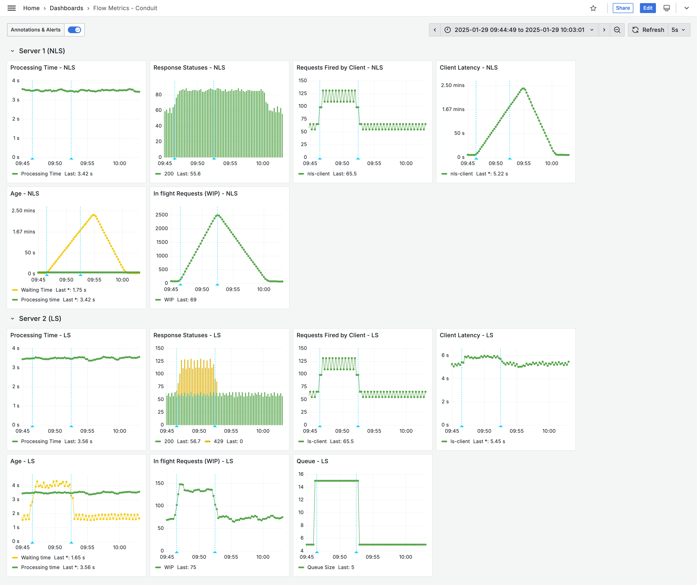

# monster-scale-2025

This project is a demo for using flow metrics to build resilient systems.

It contains two servers and two clients.

1. NLS Server - this is a server that has one HTTP endpoint `/hello` and uses a basic default implementation of a Spring Boot server. 
2. NLS Client - this is a Java client that calls the `/hello` endpoint on the NLS server.
3. LS Server - this is a server with the same functionality as the other server, but it drops requests when it detects congestion in the system. 
4. LS Client - this is a Java client that calls the `/hello` endpoint on the LS server.


Both clients call their respective servers at the same rate and the overall behaviour is governed by the
file `conduit_config.properties`. The demo contains two scenarios to showcase how flow-metrics can improve
system resilience.

### Simulating load
Experiment 1: Traffic spike ([demo video here](https://youtu.be/Z2Xg-8HIXi8))

```bash
server-processing-time-sec=3
client-concurrency=20
```` 


Experiment 2: Degraded dependency ([demo video here](https://youtu.be/cV7xROqyZ14))
```
server-processing-time-sec=6
client-concurrency=10
```

## Starting the system

```bash
docker compose up
./start_all.sh
```

## Monitoring

There is a Grafana dashboard in the file `docker-compose.yml`. The servers and clients emit metrics which
are ingested through prometheus.
- Prometheus runs on [localhost:9090](http://localhost:9090/query?g0.expr=http_server_requests_active_seconds_max&g0.show_tree=0&g0.tab=graph&g0.range_input=1h&g0.res_type=auto&g0.res_density=medium&g0.display_mode=lines&g0.show_exemplars=0)
  - The file `prometheus.yml` defines the configuration for simulating the experiments. 
- Grafana runs on [localhost:3000](http://localhost:3000/)
  - Using `Prometheus server URL` as `host.docker.internal:9090`
  - Default user/password `admin`, updated to `admin` and `admin123`


## Result 1: Traffic Spike


## Result 2: Degraded Dependency


## Notes

Generation of the maven modules:

```bash
mvn archetype:generate -DgroupId=me.mourjo -DartifactId=ls-client -DarchetypeArtifactId=maven-archetype-quickstart -DinteractiveMode=false
```
