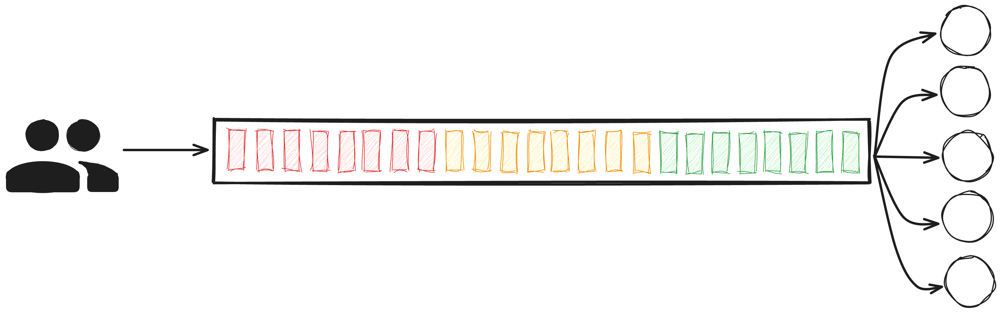
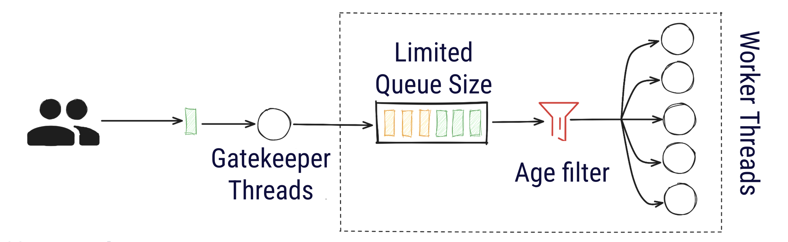
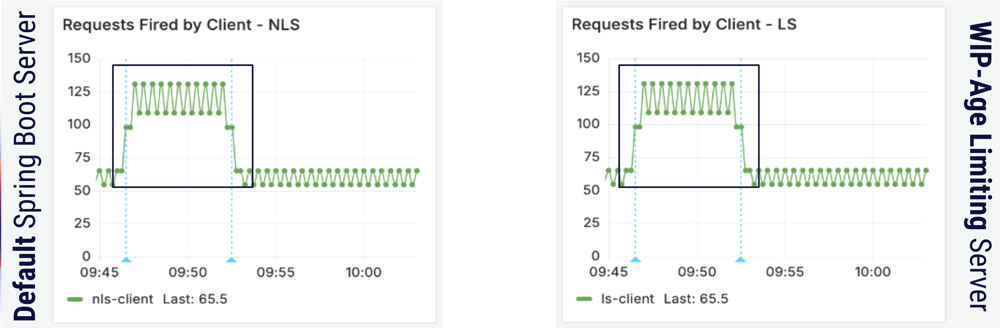
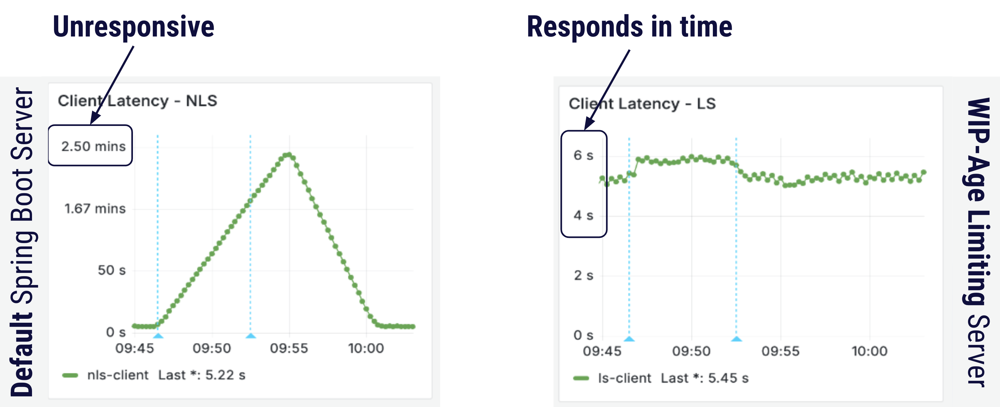
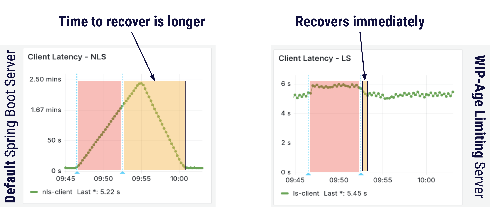
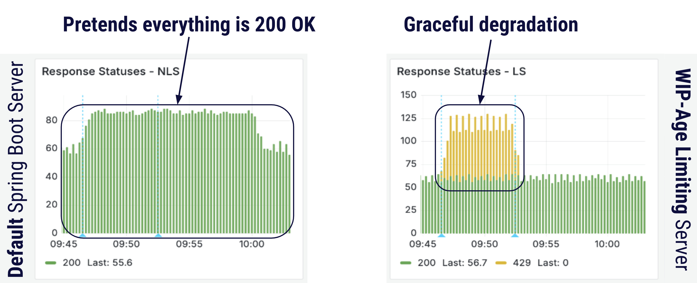
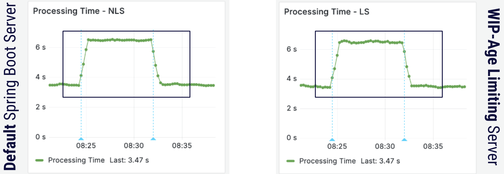
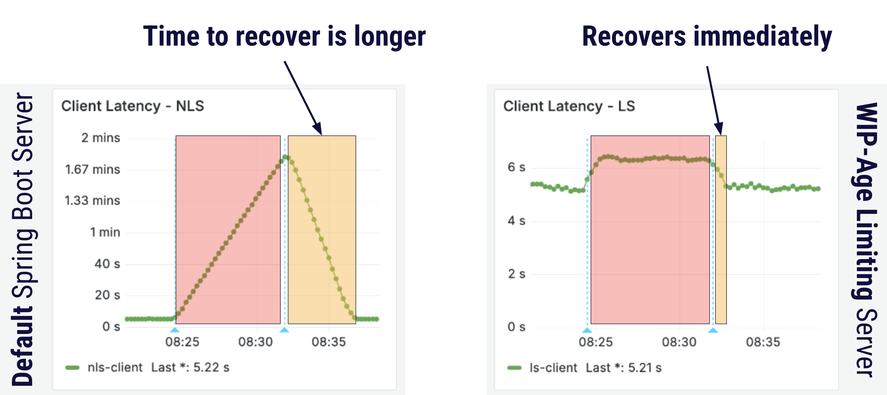
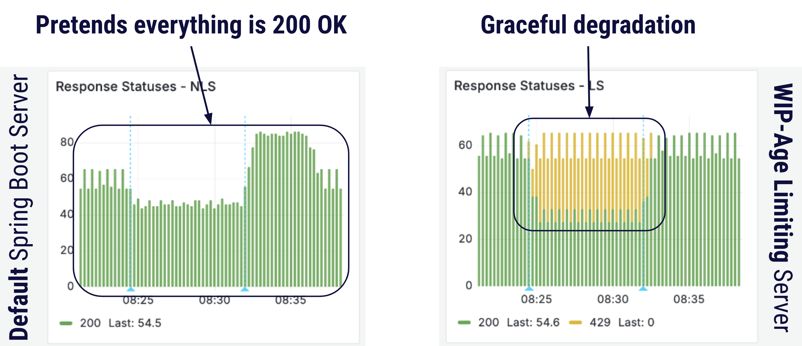

# Conduit: Resilience with Flow Metrics

This project is a demo for using flow metrics to build resilient systems.

## Background
Flow metrics are a set of measurements that help organizations understand and improve the flow of work through a process. Flow metrics help detect bottlenecks for software engineering teams that face issues in delivering business value by looking at the following:
1. **Work in progress (WIP)**: Work items that have entered a given
   process but have not exited.
2. **Age**: The total amount of time that has elapsed since an
   item entered a workflow -- applicable to unfinished items.
3. **Cycle time**: The amount of elapsed time that a work item spends
   as Work In Progress.
4. **Throughput**: The number of work items completed per
   unit of time.

In this project we focus on the first two flow metrics (WIP and age) to improve resilience in services.

## Components in this System
There are two servers and two clients in this project

1. **NLS Server** - this is a server that has one HTTP endpoint `/hello` and uses a basic default implementation of a default Spring Boot server. 
2. **NLS Client** - this is a Java client that calls the `/hello` endpoint on the NLS server.
3. **LS Server** - this is a server with the same functionality as the other server, but it drops requests when it detects congestion in the system. 
4. **LS Client** - this is a Java client that calls the `/hello` endpoint on the LS server.


Both clients call their respective servers at the same rate and the overall behaviour is governed by the
file `conduit_config.properties`. The demo contains two scenarios to showcase how flow-metrics can improve
system resilience.

## Congestion Detection and Reaction

The LS Server detects congestion by the following flow metrics in real time:
- Number of requests in flight (WIP)
- Age of requests

Whenever the server sees too many WIPs or requests getting older before completion, it drops the requests and responds to clients with appropriate a status like `429`. This is done in Spring Boot by [asynchronous request processing](https://docs.spring.io/spring-framework/reference/web/webmvc/mvc-ann-async.html#mvc-ann-async-deferredresult).   

### NLS Server allows congestion to build up



### LS Server detects and reacts to congestion


## Key Takeaways

1. NLS server takes a **long time to respond** to its clients while LS server never makes the client wait longer than 6 seconds
2. NLS server always returns 200 falsely communicating that everything is okay. LS server detects congestion and **gracefully degrades** by rejecting work it cannot do with 429 status
3. NLS server takes a much **longer time to recover** while LS server recovers almost immediately.

## Why limit WIP and Age?

We get the following benefits when the system is congested:

- **Bounded wait-time** for clients - clients will get a response within the age limit
- **Effective communication** when there is congestion - statuses like 429 signal to the client that the server is degraded
- **Faster recovery** after incident - because there is little space for requests to get queued, congestion clearance will be faster after the incident is mitigated 

WIP and age are independent of system characteristics like:
- Machines in a Cluster
- Memory and Garbage Collection
- Distribution of type of requests
- Number of downstream dependencies
- CPU Utilization
- ...

Making it widely applicable for whenever there is a disruption in the flow of requests:
- Sudden burst of traffic
- Slow dependency
- Latency bugs
- ...


## Implementation Details
- [NLS Controller](https://github.com/mourjo/resilience-with-flow-metrics/blob/main/nls-server/src/main/java/me/mourjo/conduit/nls/server/api/Controller.java#L34) - a controller with a simple endpoint that sleeps for some time and responds with a hello-world message
- [LS Controller](https://github.com/mourjo/resilience-with-flow-metrics/blob/main/ls-server/src/main/java/me/mourjo/conduit/ls/server/api/Controller.java#L72) - same in functionality as the NLS controller but degrades itself upon congestion

## Result 1: Traffic Spike
In the first scenario, there is a spike in the number of requests made to the servers.
The blue dotted lines indicate when the traffic spiked. The second server applies
WIP and age limit and protects itself from this spike but the first server (a default Spring 
Boot server) gets congested and unresponsive. 






More details:
- [_Full result here._](images/result-client-concurrency-2025-01-29-10_04_23.png)
- [_Demo video here._](https://youtu.be/Z2Xg-8HIXi8)


## Result 2: Degraded Dependency
In the second scenario, the number of requests is constant but the time to process a request increases -- simulating
a degraded dependency.
The blue dotted lines indicate when the dependency degrades and recovers. The second server applies
WIP and age limit and protects itself from this degraded dependency but the first server (a default Spring
Boot server) gets congested and unresponsive.






More details:
- [_Demo video here._](https://youtu.be/cV7xROqyZ14)
- [_Full result here._](images/result-degraded-dependency-2025-01-29-08_39_22.png)

## Experiment Parameters
To run the above experiments and see the results, update the configurations in this file: `conduit_config.properties`.

*Note: Changing the config file does not need a restart of the clients/servers.*

### Experiment 1: Traffic spike

```bash
server-processing-time-sec=3
client-concurrency=20
```` 


### Experiment 2: Degraded dependency
```
server-processing-time-sec=6
client-concurrency=10
```


## Starting the System

```bash
docker compose up
./start_all.sh
```

## Monitoring Infrastructure

There is a Grafana dashboard in the file `docker-compose.yml`. The servers and clients emit metrics which
are ingested through prometheus.
- Prometheus runs on [localhost:9090](http://localhost:9090/query?g0.expr=http_server_requests_active_seconds_max&g0.show_tree=0&g0.tab=graph&g0.range_input=1h&g0.res_type=auto&g0.res_density=medium&g0.display_mode=lines&g0.show_exemplars=0)
  - The file `prometheus.yml` defines the configuration for simulating the experiments. 
- Grafana runs on [localhost:3000](http://localhost:3000/)
  - Using `Prometheus server URL` as `http://host.docker.internal:9090`
  - Default user/password `admin`, updated to `admin` and `admin123` (this password is used in the code for basic auth)

## Importing the Grafana dashboard

The Grafana metrics shown above that can be imported as a dashboard after starting Grafana with Docker. 

1. Before importing the dashboards, add Prometheus as a datasource in the Grafana UI manually. Use the endpoint `http://host.docker.internal:9090`.
2. Import the dashboard from the Grafana UI using the file `grafana_dashboard_flow_metrics.json`
3. This will ask for a data source - use the data source created in step 1.

Note: While metrics emitted by the servers and client work out of the box, annotations (the blue 
lines in the screenshots) take a while to start showing in the UI.


## Notes

Generation of the maven modules:

```bash
mvn archetype:generate -DgroupId=me.mourjo -DartifactId=ls-client -DarchetypeArtifactId=maven-archetype-quickstart -DinteractiveMode=false
```
