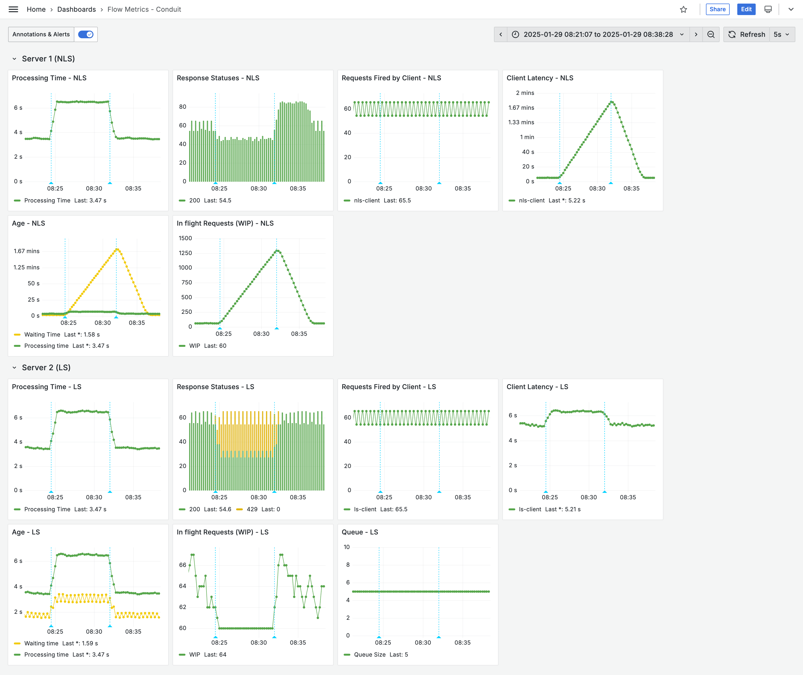

# monster-scale-2025

This project is a demo for using flow metrics to build resilient systems.

## Background
Flow metrics are a set of measurements that help organizations understand and improve the flow of work through a process. Flow metrics help detect bottlenecks for software engineering teams that face issues in delivering business value by looking at the following:
1. **Work in progress (WIP)**: Work items that have entered a given
   process but have not exited.
2. **Age**: The total amount of time that has elapsed since an
   item entered a workflow -- applicable to unfinished items.
3. **Cycle time**: The amount of elapsed time that a work item spends
   as Work In Progress.
4. **Throughput**: The number of work items completed per
   unit of time.

In this project we focus on the first two flow metrics (WIP and age) to improve resilience in services.

## Components in this System
There are two servers and two clients in this project

1. **NLS Server** - this is a server that has one HTTP endpoint `/hello` and uses a basic default implementation of a default Spring Boot server. 
2. **NLS Client** - this is a Java client that calls the `/hello` endpoint on the NLS server.
3. **LS Server** - this is a server with the same functionality as the other server, but it drops requests when it detects congestion in the system. 
4. **LS Client** - this is a Java client that calls the `/hello` endpoint on the LS server.


Both clients call their respective servers at the same rate and the overall behaviour is governed by the
file `conduit_config.properties`. The demo contains two scenarios to showcase how flow-metrics can improve
system resilience.

## Congestion Detection and Reaction

The LS Server detects congestion by the following flow metrics in real time:
- Number of requests in flight (WIP)
- Age of requests

Whenever the server sees too many WIPs or requests getting older before completion, it drops the requests and responds to clients with appropriate a status like `429`. This is done in Spring Boot by [asynchronous request processing](https://docs.spring.io/spring-framework/reference/web/webmvc/mvc-ann-async.html#mvc-ann-async-deferredresult).   

### NLS Server allows congestion to build up


### LS Server detects and reacts to congestion


## Key Takeaways

1. NLS server takes a **long time to respond** to its clients while LS server never makes the client wait longer than 6 seconds
2. NLS server always returns 200 falsely communicating that everything is okay. LS server detects congestion and **gracefully degrades** by rejecting work it cannot do with 429 status
3. NLS server takes a much **longer time to recover** while LS server recovers almost immediately.

## Implementation Details
- [NLS Controller](https://github.com/mourjo/monster-scale-2025/blob/main/nls-server/src/main/java/me/mourjo/conduit/nls/server/api/Controller.java#L34) - a controller with a simple endpoint that sleeps for some time and responds with a hello-world message
- [LS Controller](https://github.com/mourjo/monster-scale-2025/blob/main/ls-server/src/main/java/me/mourjo/conduit/ls/server/api/Controller.java#L72) - same in functionality as the NLS controller but degrades itself upon congestion

## Result 1: Traffic Spike

[_Demo video here._](https://youtu.be/Z2Xg-8HIXi8)


## Result 2: Degraded Dependency

[_Demo video here_](https://youtu.be/cV7xROqyZ14)


## Experiment Parameters
To run the above experiments and see the results, use the following configurations.

### Experiment 1: Traffic spike

```bash
server-processing-time-sec=3
client-concurrency=20
```` 


### Experiment 2: Degraded dependency
```
server-processing-time-sec=6
client-concurrency=10
```


## Starting the System

```bash
docker compose up
./start_all.sh
```

## Monitoring Infrastructure

There is a Grafana dashboard in the file `docker-compose.yml`. The servers and clients emit metrics which
are ingested through prometheus.
- Prometheus runs on [localhost:9090](http://localhost:9090/query?g0.expr=http_server_requests_active_seconds_max&g0.show_tree=0&g0.tab=graph&g0.range_input=1h&g0.res_type=auto&g0.res_density=medium&g0.display_mode=lines&g0.show_exemplars=0)
  - The file `prometheus.yml` defines the configuration for simulating the experiments. 
- Grafana runs on [localhost:3000](http://localhost:3000/)
  - Using `Prometheus server URL` as `host.docker.internal:9090`
  - Default user/password `admin`, updated to `admin` and `admin123`


## Notes

Generation of the maven modules:

```bash
mvn archetype:generate -DgroupId=me.mourjo -DartifactId=ls-client -DarchetypeArtifactId=maven-archetype-quickstart -DinteractiveMode=false
```
